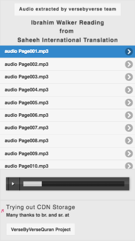

<h1>Audio Playlist From Cloud Storage</h1>

<h2>Made with JQueryMobile, audiojs html5 audio player, and few lines of code</h2>

<h3>About</h3>

Some people enjoy listening to English only. Google Cloud Storage CDN helps in this regard by allowing individuals to listen without needing to download and audio files are pasedo streamed from listeners nearest CDN point.

This app features reading of entire English Translation (<a href="http://www.saheehinternational.com/" target="_blank"> Saheeh International</a>) of Quran by Ibrahim Walker page by page. The English only was extracted by <a href="http://www.versebyversequran.com/site/">Verse by Verse Quran</a> team

A prototype App was requested that can play audio files from Cloud Storage.

<h3>Libraries Used</h3>

<a href="http://jquerymobile.com/" target="_blank">JQuery Mobile</a>

<a href="http://jquery.com/" target="_blank">JQuery</a>

<a href="http://kolber.github.io/audiojs/" target="_blank">Audio JS</a>
